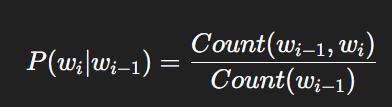
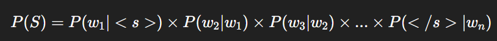
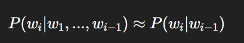

## 🎯 Core Concepts

* N-grams
* Bigram Language Model
* Probability Estimation in NLP
* Data Sparsity
* Add-One (Laplace) Smoothing
* Evaluation metrics (like perplexity)

---

## 🔍 Section 1: Basic Viva Questions

### 1. What is an n-gram?

An n-gram is a sequence of *n consecutive words* in a given text.
Examples:

* **Unigram:** “I”, “am”, “happy”
* **Bigram:** “I am”, “am happy”
* **Trigram:** “I am happy”

---

### 2. What is a bigram model?

A **bigram model** is a type of language model that predicts the probability of a word based on the *previous word*.
Mathematically:

It assumes the **Markov property** — that the next word depends only on the immediate previous word.

---

### 3. What is the probability of a sentence using the bigram model?

For a sentence ( S = w_1, w_2, ..., w_n ):

Here `<s>` and `</s>` are start and end tokens.

---

### 4. What is the Markov assumption in language modeling?

The **Markov assumption** simplifies language modeling by assuming that the probability of a word depends only on the *previous few words* rather than the entire history.
For a bigram model:

---

### 5. What is data sparsity and why is it a problem?

**Data sparsity** occurs when many possible word pairs (bigrams) never appear in the training corpus.
This causes zero probabilities for unseen word combinations — which can make an entire sentence’s probability zero even if it is grammatically valid.

---

## 🧩 Section 2: Smoothing and Probability

### 6. What is smoothing in NLP?

Smoothing adjusts probabilities so that unseen n-grams get non-zero probabilities.
It redistributes probability mass from seen to unseen events.

---

### 7. What is add-one (Laplace) smoothing?

It’s the simplest form of smoothing, where we **add 1 to all bigram counts** before calculating probabilities.

Formula:

where ( V ) = vocabulary size.
This ensures no probability is zero.

---

### 8. Why is add-one smoothing not always preferred?

Because it overestimates the probability of unseen events and underestimates frequent ones, making the model less accurate for large vocabularies.

---

### 9. What are other types of smoothing techniques?

* Add-k smoothing (generalized Laplace)
* Good-Turing discounting
* Kneser-Ney smoothing
* Backoff and interpolation models

---

### 10. How does add-one smoothing affect the bigram table?

All zero counts become 1, and total probabilities get adjusted since the denominator also includes +V.

---

## 📈 Section 3: Implementation-based Viva Questions

### 11. How do you generate bigrams from a corpus?

* Tokenize the sentence (split into words)
* Add `<s>` and `</s>` tokens
* Pair consecutive words: `zip(words[:-1], words[1:])`

Example:
Sentence: “I am fine”
Tokens: [`<s>`, `I`, `am`, `fine`, `</s>`]
Bigrams: (`<s>`, `I`), (`I`, `am`), (`am`, `fine`), (`fine`, `</s>`)

---

### 12. How do you compute the bigram probability table?

You count each pair’s occurrences and divide by the count of the first word.

| Bigram  | Count | Probability                |
| ------- | ----- | -------------------------- |
| (I, am) | 2     | Count(‘I am’) / Count(‘I’) |

---

### 13. What is the role of the start `<s>` and end `</s>` tokens?

They mark the sentence boundaries and allow us to model sentence beginnings and endings as bigrams.

---

### 14. What happens if a bigram is not found in the corpus?

Without smoothing, its probability = 0, which makes the entire sentence probability zero.
Hence, smoothing is applied.

---

### 15. How do you handle punctuation and case sensitivity in the corpus?

Usually, we:

* Lowercase all words
* Remove punctuation
* Tokenize on whitespace
  This ensures consistent bigram matching.

---

## 💬 Section 4: Advanced and Theoretical Viva Questions

### 16. How does a bigram model differ from a unigram model?

| Aspect      | Unigram    | Bigram                   |       |
| ----------- | ---------- | ------------------------ | ----- |
| Dependency  | No context | Depends on previous word |       |
| Probability | P(wi)      | P(wi                     | wi-1) |
| Accuracy    | Low        | Higher (more contextual) |       |
| Computation | Simple     | Slightly complex         |       |

---

### 17. What is perplexity and how is it related to bigram models?

**Perplexity** measures how well a language model predicts a sample.
Lower perplexity = better model.
[
Perplexity = 2^{-\frac{1}{N}\sum_{i=1}^{N}\log_2 P(w_i | w_{i-1})}
]

---

### 18. Why do we use log probabilities instead of direct multiplication?

Multiplying many small probabilities leads to numerical underflow.
Using logs converts multiplication into addition and prevents precision loss:
[
\log P(S) = \sum \log P(w_i | w_{i-1})
]

---

### 19. How do higher-order n-grams (trigram, 4-gram) improve modeling?

They capture longer context dependencies, making predictions more accurate, though requiring more data and storage.

---

### 20. What are limitations of the bigram model?

* Ignores long-distance dependencies
* Suffers from data sparsity
* Needs large corpora for accurate probabilities

---

## 🧠 Section 5: Application / Real-world

### 21. Where are n-gram models used?

* Speech recognition
* Spell correction
* Machine translation
* Text prediction (keyboards)
* Information retrieval

---

### 22. How does modern NLP replace n-grams?

Modern deep learning models (like **RNNs, LSTMs, Transformers**) learn dependencies without manually defining n-grams and handle long-range context more effectively.

---

### 23. What is the intuition behind “smoothing redistributes probability mass”?

Some probability mass from frequent words is given to unseen combinations to make the model more generalizable.

---

### 24. What is the main trade-off in bigram vs trigram models?

* **Bigram:** Less data needed, less context captured
* **Trigram:** More accurate but data-hungry (more sparse)

---

### 25. What happens to total probability after smoothing?

It remains **1**, since smoothing adjusts both numerator and denominator.

---
# LMR

## 📖 Related Theoretical Topics

| Concept                     | Description                                                           |       
| --------------------------- | --------------------------------------------------------------------- |
| **Corpus**                  | A large, structured set of text used for training language models.    |       |
| **Tokenization**            | Splitting text into smaller units (words, punctuation).               |       |
| **Conditional Probability** | Probability of one event given another. | 
| **Markov Assumption**       | Current word depends only on a limited history (e.g., previous word). |       |
| **Data Sparsity**           | Many word combinations never appear in finite corpora.                |       |
| **Smoothing Techniques**    | Adjust probability estimates to avoid zeros.                          |       |
| **Backoff / Interpolation** | Methods to combine higher and lower order models.                     |       |

---

## 🎤 Viva Questions (Detailed + Categorized)

### 🟩 **Basic Questions**

1. **What is a corpus?**

   * A collection of text used for training and testing NLP models.

2. **What is tokenization?**

   * Splitting text into words or tokens that serve as model input.

3. **Define a bigram.**

   * A sequence of two consecutive words: `(wᵢ, wᵢ₊₁)`.

4. **Differentiate between unigram and bigram models.**

   * Unigram assumes word independence; Bigram considers one prior word.

5. **Why do we use lowercasing during preprocessing?**

   * To maintain consistency and avoid treating “The” and “the” as different words.

---

### 🟨 **Intermediate Questions**

1. **What is the Markov assumption in bigram models?**

   * That each word depends only on the immediate previous word.

2. **How do you calculate P(w₂ | w₁) from a corpus?**
   [
   P(w₂ | w₁) = \frac{Count(w₁, w₂)}{Count(w₁)}
   ]

3. **What is the issue with zero probabilities?**

   * If one bigram has zero probability, the entire sentence probability becomes zero.

4. **What is add-one smoothing?**

   * A technique that adds one to all bigram counts to avoid zero probabilities.

5. **How does vocabulary size affect smoothing?**

   * Larger vocabulary → smaller probability assigned per unseen bigram.

6. **What happens if you don’t apply smoothing in small datasets?**

   * Model fails to generalize; many sentences get zero probability.

---

### 🟥 **Advanced Viva Questions**

1. **Why does add-one smoothing reduce accuracy on large corpora?**

   * Because it overestimates rare words, distorting probability distribution.

2. **What are alternatives to add-one smoothing?**

   * Add-k, Good-Turing, Kneser-Ney, and Witten-Bell smoothing.

3. **What is the limitation of bigram models in NLP?**

   * They fail to capture long-range dependencies beyond one word.

4. **What is Perplexity and how is it used?**

   * A measure of model performance: lower perplexity = better prediction.

5. **Explain how bigrams relate to Language Modeling in general.**

   * Bigram models form the foundation of statistical language models used before neural LMs.

6. **If your bigram table is sparse, what other technique can you use besides smoothing?**

   * Backoff models or interpolation combining unigram, bigram, and trigram probabilities.

7. **How are bigram probabilities estimated from counts?**

   * Using **Maximum Likelihood Estimation (MLE)**: `P = Count(bigram) / Count(unigram)`.

8. **What is the impact of corpus domain on bigram probabilities?**

   * Probabilities are domain-specific; a model trained on medical text won’t perform well on legal text.

9. **How is sentence boundary handled in bigram models?**

   * By adding special tokens `<s>` (start) and `</s>` (end).

---

## 🧩 Example Viva Follow-up Scenario

> **Examiner:** Why did you use add-one smoothing?
>
> **Answer:** Because some bigrams may not appear in the corpus. Without smoothing, their probability becomes zero, which causes the entire sentence probability to collapse to zero. Add-one smoothing ensures every bigram has a non-zero probability by adding 1 to each count.

---

## 🧠 Summary

* Bigram model predicts each word based on its previous word.
* Uses conditional probability.
* Add-one smoothing handles unseen pairs.
* Important for foundational understanding of probabilistic NLP and language modeling.
