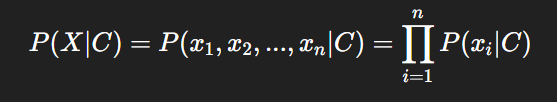
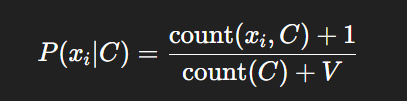
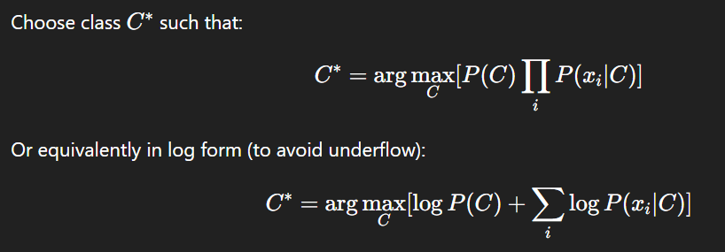
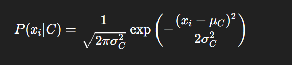

### 1. What is Classification?

* **Classification** is a supervised learning task where we assign input data to one of several predefined labels (or classes).
* **Binary classification** → only 2 classes, e.g. spam/ham, positive/negative, yes/no.

---

### 2. What is Naive Bayes Classifier?

* Naive Bayes is a **probabilistic classifier** based on **Bayes’ theorem**, assuming that all features are **conditionally independent** given the class label.
* It’s called *“Naive”* because this independence assumption rarely holds in real life, yet it works surprisingly well in practice.

---

### 3. Bayes’ Theorem


Where:

* ( P(C|X) ): Posterior probability → probability of class C given feature X
* ( P(X|C) ): Likelihood → probability of observing X given class C
* ( P(C) ): Prior probability of class C
* ( P(X) ): Marginal probability of observing X

In classification, we don’t need ( P(X) ) (same for all classes), so we choose the class that maximizes:


---

### 4. Why is it called “Naive”?

Because it **assumes feature independence**:


This means each feature contributes independently to the class probability — even though in real data features are often correlated.

---

### 5. Types of Naive Bayes Classifiers

There are 3 main types:

| Type                        | When to use                                       | Example                                                  |
| --------------------------- | ------------------------------------------------- | -------------------------------------------------------- |
| **Gaussian Naive Bayes**    | Continuous features following normal distribution | Predicting Iris species using sepal/petal length         |
| **Multinomial Naive Bayes** | Discrete counts (word frequencies)                | Text classification (spam detection, sentiment analysis) |
| **Bernoulli Naive Bayes**   | Binary features (word presence/absence)           | Document classification with Boolean term vectors        |

---

### 6. Formula for Prediction (Multinomial/Bernoulli)


---

### 7. Smoothing (Laplace / Add-One Smoothing)

* Problem: Some words/features may not appear in training data for a given class, leading to **zero probability**.
* Solution: Apply **Laplace smoothing**:
 
  
  where **V = number of unique features**.

---

### 8. Advantages

* Fast and efficient even with large datasets.
* Requires small training data.
* Works well with text data and NLP.
* Easy to implement and interpret.

### 9. Limitations

* Assumes independent features (not realistic).
* Performs poorly if features are highly correlated.
* For continuous features, assumes normal distribution (may not hold).

---

## 🔍 THEORY-BASED VIVA QUESTIONS (with Answers)

### Q1. What is Naive Bayes used for?

It’s used for **classification tasks**, especially **text classification** like spam detection, sentiment analysis, document categorization, etc.

---

### Q2. Why is it called “Naive”?

Because it assumes that all features are **independent given the class**, which is a “naive” or unrealistic assumption in most real datasets.

---

### Q3. What is the intuition behind Naive Bayes?

We calculate **how likely a sample belongs to each class** based on the frequency and likelihood of its features, and pick the class with the highest probability.

---

### Q4. What are Priors and Posteriors in Naive Bayes?

* **Prior (P(C))**: What we believe about class probabilities before seeing data.
* **Posterior (P(C|X))**: Updated belief after seeing evidence (features X).

---

### Q5. What happens if a word/feature doesn’t appear in the training data for a class?

Its probability becomes zero, and hence the whole product becomes zero.
To fix this, **Laplace (Add-One) smoothing** is used.

---

### Q6. What are the key assumptions of Naive Bayes?

1. Features are independent given the class.
2. Each feature contributes equally and independently to the final probability.
3. The dataset is correctly labeled and representative.

---

### Q7. What is the mathematical decision rule for classification?



---

### Q8. What is the difference between Multinomial and Bernoulli Naive Bayes?

| Aspect   | Multinomial            | Bernoulli             |
| -------- | ---------------------- | --------------------- |
| Features | Word counts            | Word presence/absence |
| Use-case | Bag-of-words text data | Binary term vectors   |
| Output   | Frequency-sensitive    | Binary (1 or 0)       |

---

### Q9. What if the features are continuous?

Use **Gaussian Naive Bayes** where


---

### Q10. How is Naive Bayes different from Logistic Regression?

| Aspect        | Naive Bayes                   | Logistic Regression                   |
| ------------- | ----------------------------- | ------------------------------------- |
| Type          | Generative                    | Discriminative                        |
| Assumption    | Features are independent      | No independence assumption            |
| Probabilities | Estimated using Bayes theorem | Estimated by fitting sigmoid function |
| Performance   | Works better on small data    | Works better with correlated features |

---

### Q11. What are real-world applications of Naive Bayes?

* Spam filtering
* Sentiment analysis
* Medical diagnosis
* Document classification
* Email classification
* News categorization

---

### Q12. What is the main disadvantage of Naive Bayes?

If features are **correlated**, the independence assumption fails → inaccurate probabilities.

---

### Q13. Why is Naive Bayes good for text classification?

Because word occurrences in text roughly follow independence assumption and probabilities can be efficiently estimated using frequency counts.

---

### Q14. What is Zero-Frequency Problem?

It occurs when a feature does not appear in the training data for a class, leading to probability = 0.
Solved using **Laplace/Add-One smoothing**.

---

### Q15. Can Naive Bayes handle continuous as well as discrete data?

Yes — using **Gaussian Naive Bayes** for continuous and **Multinomial/Bernoulli** for discrete data.

---

## 💻 IMPLEMENTATION-BASED QUESTIONS

Assuming your notebook uses **Scikit-learn** (`from sklearn.naive_bayes import MultinomialNB or GaussianNB`), here are viva-style questions:

### Q1. What preprocessing did you perform before applying Naive Bayes?

* Tokenization or vectorization (e.g., CountVectorizer / TF-IDF)
* Label encoding or train-test split
* Normalization for continuous data (if using GaussianNB)

---

### Q2. What dataset was used?

You can say:

> A labeled dataset for binary classification (e.g., positive/negative sentiment or spam/ham emails).

---

### Q3. What function did you use to train and predict?

```python
model.fit(X_train, y_train)
y_pred = model.predict(X_test)
```

---

### Q4. How do you evaluate performance?

Using metrics such as:

* Accuracy
* Precision
* Recall
* F1-score
* Confusion matrix

---

### Q5. What is the confusion matrix?

It shows counts of:

|                     | Predicted Positive | Predicted Negative |
| ------------------- | ------------------ | ------------------ |
| **Actual Positive** | TP                 | FN                 |
| **Actual Negative** | FP                 | TN                 |

---

### Q6. How do you calculate Accuracy?

Accuracy = (TP + TN) / (TP + TN + FP + FN)


---

### Q7. What is the effect of smoothing parameter `alpha` in Naive Bayes?

* `alpha = 1` → Laplace smoothing
* `alpha < 1` → less smoothing
* Prevents zero probabilities and stabilizes the model.

---

### Q8. How does Naive Bayes handle unseen words during testing?

Due to **smoothing**, unseen words get a small non-zero probability, so model remains stable.

---

### Q9. Can Naive Bayes be used for multi-class problems?

Yes. Although we’re doing binary classification here, Naive Bayes naturally supports **multi-class classification**.

---

### Q10. How does log transformation help in Naive Bayes?

Instead of multiplying many small probabilities (which may underflow to zero), we take log:


This ensures numerical stability.

---

## 🧩 RELATED CONCEPTS YOU SHOULD KNOW

### 1. Probability Basics

* Joint Probability: ( P(A,B) = P(A|B)P(B) )
* Conditional Probability: ( P(A|B) = P(A,B) / P(B) )
* Marginal Probability: sum of joint probabilities over all possibilities.

---

### 2. Independence

If A and B are independent:

P(A|B) = P(A)


---

### 3. Logarithmic Rule

Log is monotonic, so maximizing ( P(C|X) ) ≡ maximizing ( log P(C|X) ).
Used to simplify multiplication to addition.

---

### 4. Bias-Variance View

* Naive Bayes has **high bias** (strong independence assumption)
* But **low variance**, so it generalizes well on small datasets.

---

### 5. When NOT to use Naive Bayes

* When features are highly dependent (e.g., pixels in image data)
* When continuous features are not normally distributed (for GaussianNB)

---

## 🎯 POSSIBLE FINAL QUESTIONS

### Which Naive Bayes variant suits text classification? Why?

Multinomial Naive Bayes is best for text classification tasks like spam filtering, sentiment analysis, etc.

Reason:

* It models word counts or term frequencies, which naturally occur in text data.

* It captures how often a word appears in a document, not just its presence.

* If using binary presence (word exists or not), Bernoulli Naive Bayes can also be used, but Multinomial usually performs better for text.

### Why is Naive Bayes fast and efficient?

* Linear Time Complexity (O(n)) — only needs to count feature occurrences.

* No parameter tuning (unlike SVM or Neural Nets).

* Few computations — only multiplication and addition of probabilities.

* Simple training — doesn’t require gradient descent or iterative optimization.

* Low memory usage — stores simple frequency tables or Gaussian parameters.

### What is the difference between Naive Bayes and other classifiers like SVM or Decision Tree?

| Aspect               | **Naive Bayes**                     | **SVM**                         | **Decision Tree**                 |
| -------------------- | ----------------------------------- | ------------------------------- | --------------------------------- |
| Type                 | Probabilistic (Generative)          | Discriminative                  | Non-parametric, tree-based        |
| Training             | Simple (uses frequency/probability) | Requires optimization           | Requires recursive splitting      |
| Speed                | Very fast                           | Slower (quadratic optimization) | Moderate                          |
| Data Size            | Works well on small/large data      | Needs careful scaling           | Handles categorical data well     |
| Feature Independence | Assumes independence                | No such assumption              | No independence assumption        |
| Output               | Class probabilities                 | Class boundaries                | Decision rules                    |
| Use case             | Text/NLP tasks                      | Complex non-linear tasks        | Interpretability, rule extraction |

### Can Naive Bayes handle missing data?

Answer:
Not directly — Naive Bayes cannot handle missing feature values by itself.

Why:
It requires probabilities 
𝑃(𝑥𝑖 ∣ 𝐶) for all features. If a feature is missing, it can’t compute the full product of probabilities.

Workarounds:

* Imputation — fill missing values using mean/median/mode (for continuous features) or most frequent value (for categorical).

* Removal — drop rows with missing data if few in number.

* Use algorithms that support missing values (e.g., Decision Trees, XGBoost).